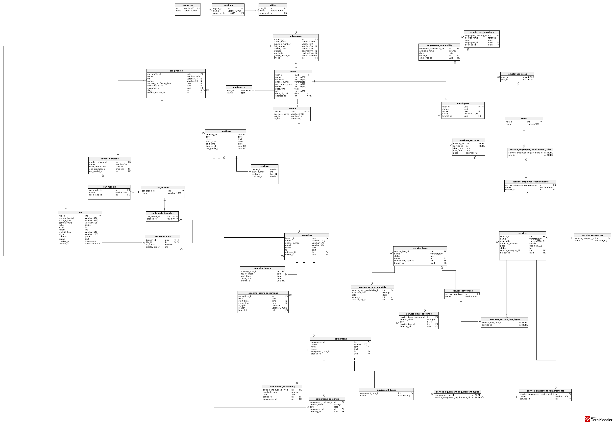

# CarFix

**Live app: [carfix.one](https://carfix.one)**

CarFix is a web platform for finding car repair workshops and booking visits online. Customers choose their car, the services they need, and a suitable time. Workshop owners manage their branches, services, employees, equipment, and service bays.

CarFix offers times based on opening hours, existing bookings, and available resources. Customers can book up to three services in one visit without waiting for confirmation by phone.

This repository contains the backend and the main project documentation. See also the [frontend README](https://github.com/DmytroHutnyk/carfix-frontend#readme) and [deployment repository](https://github.com/DmytroHutnyk/carfix-deploy).

## Backend

The REST API handles search, accounts, car profiles, bookings, reviews, and workshop management. It calculates visit times, confirms or cancels bookings, and sends e-mails when SMTP is configured.

**Stack:** Java 25, Spring Boot 3.5, Spring Security, Spring Data JPA / Hibernate, PostgreSQL 17, Flyway, and Maven. Authentication uses server-side sessions and cookies.

The backend follows **hexagonal architecture**. `applicationHexagon` holds business objects, scheduling rules, and use cases. `ports` defines interfaces, while `adapters` implements REST endpoints, database access, and e-mail delivery. `boot` starts the application and runs migrations; `common` provides shared utilities.

## Frontend

Built with Next.js 16, React 19, TypeScript, and Tailwind CSS, the frontend provides search, maps, booking, customer accounts, and an owner dashboard. See the [frontend README](https://github.com/DmytroHutnyk/carfix-frontend#readme).

## Database

PostgreSQL stores accounts, car profiles, branches, services, resources, availability, bookings, and reviews. Flyway applies schema migrations at backend startup.

## CI/CD

GitHub Actions checks and releases each application independently:

1. **Pull requests and pushes to `dev`:** backend CI runs `./mvnw -B clean verify`. Database-dependent `*IT` integration tests are outside this default test run. Frontend CI installs dependencies, checks TypeScript, and builds the production application.
2. **Pushes to `main` or manual releases:** backend verification or frontend TypeScript checks must pass first. Docker builds each application and publishes a `linux/amd64` image to GitHub Container Registry, tagged with `latest` and the commit SHA.
3. **Shared deployment:** each release triggers `carfix-deploy` through `repository_dispatch`. Its workflow copies configuration over SSH, pulls the configured images, and applies Docker Compose. Deployment jobs run one at a time.
4. **Health check:** deployment polls `/actuator/health` for up to 150 seconds and fails unless the backend reports `UP`. Running images are recorded in the workflow summary. There is no automatic rollback.

Production runs Caddy, the frontend, backend, and PostgreSQL on one server. Caddy manages HTTPS and routes `/api/*` to the backend, keeping the website and API on one origin. Database data persists in a Docker volume; deployment scripts also provide local database backups.

| Configuration | Where it is used |
| --- | --- |
| `GITHUB_TOKEN` | Publishes images to the registry |
| `DEPLOY_TOKEN` | Application repository secret that triggers shared deployment |
| `NEXT_PUBLIC_API_BASE`, `NEXT_PUBLIC_GOOGLE_MAPS_API_KEY` | Frontend release secrets passed into the Docker build; production API base is `/api` |
| `SSH_KEY`, `SSH_HOST`, `SSH_USER` | Deployment repository secrets for server access |
| `DOMAIN` | Optional deployment repository variable for the health check |
| `/opt/carfix/.env` | Server-side image references, domain, database credentials, and mail settings |

`NEXT_PUBLIC_*` values are visible in the browser bundle. Restrict the Maps key by website and API, and keep private credentials out of these variables and Git. Separate frontend and backend releases must remain API-compatible during deployment.

Workflow definitions: [backend CI](.github/workflows/ci.yml), [backend release](.github/workflows/release.yml), [frontend workflows](https://github.com/DmytroHutnyk/carfix-frontend/tree/main/.github/workflows), and [shared deployment](https://github.com/DmytroHutnyk/carfix-deploy/blob/main/.github/workflows/deploy.yml).

## Booking engine in detail

**What is stored.** Each bay, employee, and equipment unit has dated availability ranges and separate occupied ranges linked to bookings. PostgreSQL stores these as `tsrange` values with `[start, end)` bounds: the start is included and the end is excluded, so consecutive bookings can meet at the same time. Offered start times are calculated on demand, rather than saved as individual slots.

**How free time is derived.** The engine merges overlapping or adjacent availability ranges, subtracts occupied ranges, and limits the result to branch opening hours, including date-specific exceptions:

`free time = (resource availability − occupied time) ∩ branch opening hours`

For example, availability from 09:00–17:00, a booking from 10:00–11:00, and opening hours from 09:00–16:00 produce free ranges of 09:00–10:00 and 11:00–16:00. This calculation runs separately for every resource. A visit needs a combination of resources that are free for the required service durations.

**How a visit is planned.** The engine checks candidate starts on a 15-minute grid, using one compatible bay for the whole visit. For up to three selected services, it tries their possible orders and uses backtracking to place them in sequence, allowing gaps of up to 15 minutes. If a choice blocks a later service, it tries another placement or order.

For each service, employees must have suitable roles and equipment must have suitable types. Bipartite matching assigns a different employee or equipment unit to each simultaneous requirement. It can reassign earlier choices to find a valid combination, so one multi-skilled employee cannot count as two people at once. Results for the same service and start time are cached within the calculation. Valid visit starts are sorted and duplicates removed.

**What happens when someone books.** The backend calculates the selected visit again and saves the booking, service segments, and occupied ranges in one transaction. The bay is occupied for the entire visit, including gaps; employees and equipment are occupied only during their assigned services. PostgreSQL GiST exclusion constraints reject overlapping reservations for the same resource if customers book concurrently. Cancellation removes the occupied ranges while retaining the booking record, allowing those times to become available again.
